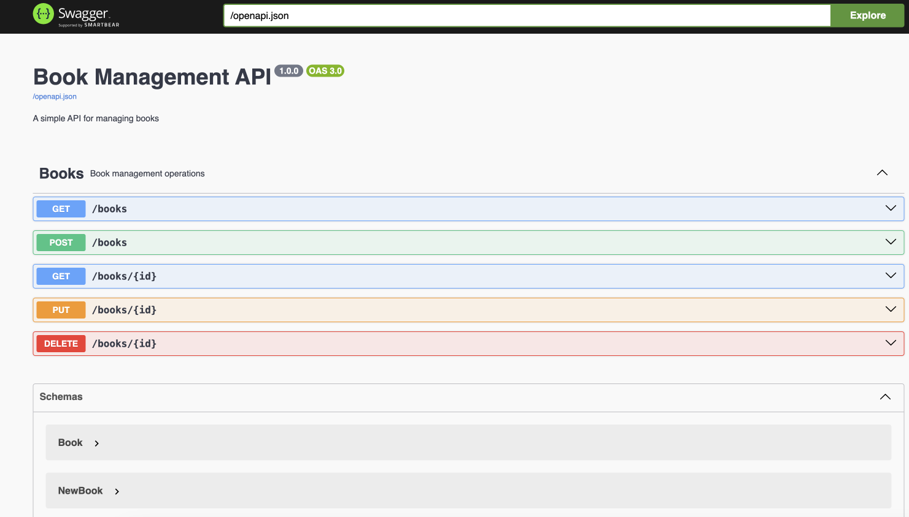
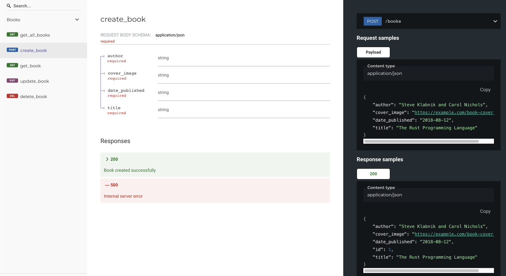

# swift-api-rest-rs-warp

This project implements a simple API just to illustrate how one would go about implementing a REST API using [warp](https://github.com/seanmonstar/warp) and [Rust](https://www.rust-lang.org/). 

> This repository is largely a copy of [swift-api-rest-rs](https://github.com/swiftsoftwaregroup/swift-api-rest-rs) but using Warp instead of Actix Web. 

## Setup

* [Setup for macOS](./docs/setup-macos.md)

## Run

```bash
source configure.sh

cargo run

# or
cargo watch -x check -x run

# or
./watch.sh
```

Browse the docs and test the API via the Swagger UI:

```bash
open http://localhost:8001/docs
```



Browse the docs using Redoc. This is an alternative to the Swagger UI:

```bash
open http://localhost:8001/redoc
```



## Updating the code

Configure project:

```bash
source configure.sh
```

Open the project in Visual Studio Code:

```bash
code .
```

## Development

### Code Formatting & Linting

Run `rustfmt` formatter:

```bash
# check
cargo fmt --all -- --check

# fix
cargo fmt --all
```

Run `clippy` linter:

```bash
# check
cargo clippy -- --deny warnings

# fix
cargo clippy --fix --allow-dirty
```

### Test

Run tests:

```bash
cargo test
```

Generate test coverage report:

```bash
./coverage.sh

# or
cargo tarpaulin --skip-clean --ignore-tests --out Html --output-dir coverage

# open coverage report
open coverage/tarpaulin-report.html
```

### Build

```bash
cargo build
```

### Database Management

Setup DB migrations:

```bash
diesel setup
```

Generate a new DB migration:

```bash
diesel migration generate create_books
```

Apply DB migrations:

```bash
diesel migration run
```

## Run in Podman / Docker 

> In order to do this you will need Podman. See [Setup Podman on macOS](./docs/setup-podman-macos.md) for details.

Rebuild container image and start container:

```bash
./scripts/podman.sh
```

Delete container and image:

```bash
./scripts/podman-delete.sh
```

## How to create a new project

```bash
# create new project
cargo init

# add packages
cargo add warp dotenv
cargo add diesel --features sqlite,r2d2

cargo add serde --features derive
cargo add serde_json
cargo add chrono --features serde

cargo add utoipa --features chrono
cargo add utoipa-swagger-ui

cargo add diesel_migrations

# dev packages
cargo add tokio-test --dev
```

Install tools :

```bash
# Diesel CLI
cargo install diesel_cli --no-default-features --features sqlite
# Watch
cargo install cargo-watch
# Test Coverage
cargo install cargo-tarpaulin
```

